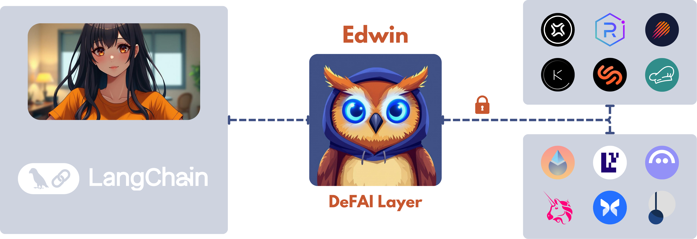

# Edwin 🦉 - DeFAI Layer



Edwin is a TypeScript library that serves as the bridge between AI agents and DeFi protocols. It provides a unified, secure interface for AI agents to interact with various DeFi protocols while abstracting away the complexity of blockchain operations and protocol-specific implementations. This enables the creation of sophisticated DeFAI agents.

## Installation

```bash
pnpm install edwin-sdk
```

## Features

- Lending/Borrowing operations
- Liquidity provision
- Cross-chain support
- Type-safe protocol interactions
- AI-friendly templates

## Quick Start

```typescript
import { Edwin, EdwinConfig } from 'edwin-sdk';

// Configure Edwin wallets and providers
const edwinConfig: EdwinConfig = {
    evmPrivateKey: process.env.PRIVATE_KEY,
    solanaPrivateKey: process.env.SOLANA_PRIVATE_KEY,
    actions: ['supply', 'withdraw', 'stake'],
};

// Initialize Edwin SDK
const edwin = new Edwin(edwinConfig);

// Supply tokens to a lending protocol
await edwin.actions.supply.execute({
    protocol: 'aave',
    chain: 'base',
    amount: '100',
    asset: 'usdc',
});
```

## Documentation

For detailed documentation, visit [docs.edwin.finance](https://docs.edwin.finance)

## Contributing

Contributions are welcome! Please visit our [Contributing Guide](https://docs.edwin.finance) for details.

## License

GPL
